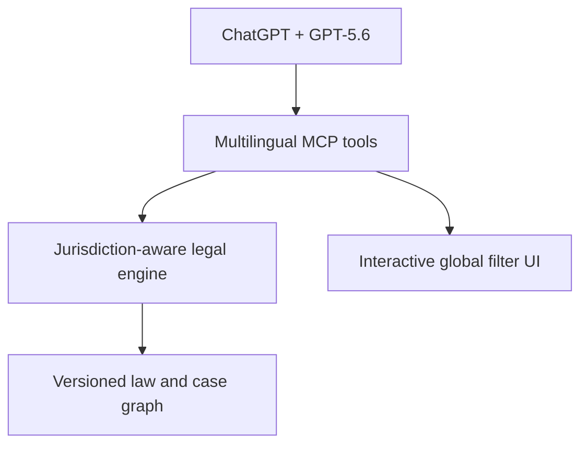

# Al-Muhami Global (المحامي العالمي)

**From jurisdiction to code, article, case, and precedent.**

Al-Muhami Global is a multilingual ChatGPT App for structured legal research and procedural triage across jurisdictions. It lets a user choose a language and country, open a sourced legal provision and linked case path, compare materially similar final decisions, or choose a civil/criminal track and exact decision to see compatible challenge routes and a safe pleading checklist.

> Research assistant only. It is not legal advice. Always verify the complete official text, the version applicable on the relevant date, the jurisdiction, the facts, and the full procedural record.

## Product vision

Most legal databases begin and end with a search box. Al-Muhami Global adds an explainable research path:

```text
Language → Country → Legal code → Article → Related cases
         → Court / topic → Trial → Appeal → Cassation → Correction or review
         → Similar facts + different final outcomes → Potential divergence
         → Civil / criminal → Decision type → Compatible remedy → Pleading checklist
```

Court structures and remedies are jurisdiction-specific. The product therefore does not force every country into the same labels. Iraq may include correction of a cassation decision; France and Egypt use their own court and procedure taxonomies. The global layer is shared, while each jurisdiction owns its sources, version history, courts, terminology, and validation policy.

## Languages and countries in the MVP

The interface supports:

- English
- Arabic, including full right-to-left layout
- French
- Spanish

The architecture can add more interface languages without translating legal text automatically. A legal provision remains in its official original language unless a verified translation is stored with separate provenance.

The pilot exposes three country filters:

| Country | MVP status | Current content |
|---|---|---|
| Iraq | Working legal, procedural-route, and case-path demonstration | 11 law/instrument families, 8 embedded provisions, 3 published judicial references, 12 encoded remedy routes, and clearly labeled synthetic procedural paths |
| France | Catalog pilot | 5 code families and an official French Civil Code article example |
| Egypt | Catalog pilot | 5 core law-family entries; official consolidated texts still need to be connected |

This is a product and architecture demonstration, not a complete global legal database.

## Core workflows

### Article-first research

1. Select a language and country.
2. Select a legal code.
3. Enter or select an article number.
4. Open the article in its verified available language.
5. Review source, effective-version warning, linked cases, facts, courts, stages, and outcomes.

If the article is not in the pilot corpus, the app reports the gap. It never invents text to fill it.

### Court-first research

1. Select a country.
2. Select a court type and a case topic—for example, an Iraqi Court of First Instance and dissolution of co-ownership.
3. Retrieve matching case paths.
4. Open trial, appeal, cassation, and correction decisions as linked stages of the same dispute.

### Divergence research

1. Filter to a country, topic, court, law, or article.
2. Compare effective final decisions from separate cases.
3. Score the overlap in legal issue, material facts, cited provisions, governing-law version, and procedural stage.
4. Classify the pair as consistent, distinguishable, corrected/superseded, requiring full text, or a potential divergence.

The app never presents a similarity score as a legal holding.

### Procedural remedy and pleading assistant

1. Select Iraq and choose the civil or criminal track.
2. Identify the exact judgment, order, cassation decision, penal order, or investigative decision.
3. Select only from remedies compatible with that combination.
4. Review standing questions, exclusions, filing authority, legal basis, and a deadline warning.
5. Open a structured pleading checklist for the selected route—or start with a civil statement of claim or criminal complaint.

The Iraqi civil pilot encodes objection to a default judgment, appeal, retrial, cassation, correction of a cassation decision, third-party objection, and the separate grievance against an order on a petition. The criminal pilot encodes default objection, penal-order objection, cassation, correction, and retrial. It deliberately does not invent an ordinary criminal “appeal” route, and it never treats grievance as a universal challenge to every decision.

Templates contain headings, attachment checks, and validation questions. They do not invent facts, evidence, authorities, dates, signatures, or filing status, and they do not automatically guarantee a deadline.

## Iraqi Civil Procedure Law article 305

The featured Iraqi provision is article 305 of Civil Procedure Law No. 83 of 1969—not article 305 of the Civil Code. It assigns the issuance of an Iraqi heirship certificate to the court of the deceased's permanent residence, addresses territorial competence for estate inventory, and locates estate liquidation subject to other courts' powers over assets in their custody.

The MVP links that provision to a fully anonymized synthetic case, **Salim Nasser v. the children of Amal Fouad**. Every name, date, and case identifier is fictional or altered. The timeline contains an earlier foreign heirship record, a synthetic Iraqi Personal Status Court decision, and a synthetic cassation reversal and remand. It intentionally contains no appeal or correction decision because neither is verified for the example.

The case keeps three legal questions separate:

- Civil Procedure Law article 305 concerns the Iraqi court competent to issue the heirship certificate.
- Civil Code article 22 is a choice-of-law rule for the substantive inheritance question.
- Riyadh Agreement articles 25 and 30 concern conditional recognition of a qualifying foreign judgment; recognition is not automatic and depends on jurisdiction, finality, notice, public policy, and the instrument's applicability between the relevant states.

These are linked research layers, not interchangeable rules. The synthetic decisions demonstrate the analysis and cannot be cited as judicial authority.

## ChatGPT App tools

| Tool | Purpose |
|---|---|
| `browse_jurisdictions` | Languages, countries, court types, topics, and corpus coverage |
| `browse_legal_catalog` | Laws and embedded article numbers for one country |
| `get_law_article` | Article text, language, sources, linked cases, and linked decisions |
| `browse_court_cases` | Cases filtered by country, court, topic, stage, law, and article |
| `search_legal_materials` | Multilingual search across laws, articles, cases, and decisions |
| `trace_case_path` | Every linked procedural decision in one case |
| `compare_decisions` | Explainable comparison of two to four decisions |
| `find_jurisprudential_divergence` | Similar final decisions with different outcomes and safeguards |
| `browse_procedural_routes` | Civil/criminal remedy filters, eligibility, exclusions, authority, source, and deadline warning |
| `get_filing_template` | Initial-pleading or challenge checklist with sections, attachments, and validation questions |
| `get_legal_source` | Full record and provenance links |

All tools are read-only, non-destructive, and idempotent.

## Architecture



GPT-5.6 in ChatGPT interprets the question, chooses the research tools, and explains the structured result. Deterministic application code controls retrieval, filters, procedural links, similarity features, and safety labels. The server does not use a language model to invent citations.

## How the entrant collaborated with Codex and GPT-5.6

The entrant is the product owner and made the core product, legal-workflow, and safety decisions. Those decisions include:

- defining the global path from language and country to law, article, case, court stage, and comparable final decisions;
- correcting the featured Iraqi reference from Civil Code article 305 to Civil Procedure Law article 305;
- keeping Civil Procedure article 305, Civil Code article 22, and Riyadh Agreement articles 25 and 30 as separate legal questions;
- requiring fictional names and identifiers for the demonstration case;
- adding civil/criminal filters, decision-specific challenge routes, grievances, and pleading checklists;
- preserving original-language legal text and refusing to invent missing provisions, decisions, deadlines, facts, or citations; and
- choosing a jurisdiction-specific architecture instead of forcing every country into an Iraqi or common-law taxonomy.

Codex accelerated implementation by translating those decisions into the Node.js architecture, MCP tool schemas, multilingual responsive interface, jurisdiction and procedure filters, deterministic comparison logic, synthetic demonstration data, automated tests, deployment files, and submission documentation. The entrant reviewed the workflows, corrected the legal scope, selected the examples, and approves the final product and submission.

In the final ChatGPT App, GPT-5.6 is the conversational orchestration layer: it interprets the user's request, invokes the appropriate read-only MCP tools, and explains the returned structured records. It does not create the stored legal text or case citations. Before submission, the entrant must run and record the final app in a GPT-5.6 conversation and use `/feedback` in the primary eligible Codex build session. The submission should claim only the model and work actually used and verified.

## Build Week development record

The working MVP and its material feature set were implemented or meaningfully extended during the 13–21 July 2026 Build Week period. The dated 18 July release includes:

- eleven MCP research tools and a standalone interactive demo;
- four interface languages and three jurisdiction filters;
- article-first, court-first, case-path, and conservative divergence workflows;
- twelve encoded Iraqi civil/criminal procedural routes and fourteen filing checklists;
- the anonymized article 305 cross-border example and clearly synthetic co-ownership examples;
- safety, privacy, licensing, data-provenance, deployment, and testing documentation; and
- twenty-nine automated checks covering the legal engine, UI, HTTP routes, and MCP calls.

Final evidence should include the repository's dated commits, the release archive, the primary Codex `/feedback` Session ID, and the public demo video. If any code existed before 13 July 2026, the entrant must identify it and describe only the material Build Week extension as new work.

## Data model

- **Country:** ISO-style code, multilingual name, default language, official sources.
- **Legal instrument:** country, category, number, year, titles, original language, amendment/version status.
- **Article:** number, original text, verified translations, source, effective period.
- **Case:** jurisdiction, subject, parties redaction status, procedural links.
- **Decision:** court, chamber, date, number, stage, facts, reasoning, outcome, provisions, source quality.
- **Relationship:** appealed-by, cassated-by, corrected-by, applies-article, similar-to, distinguished-by.
- **Procedural route:** jurisdiction, case track, decision type, remedy, eligibility, exclusions, filing authority, source, and template.
- **Filing template:** initial filing or challenge, required sections, route-specific focus, attachments, validation questions, and privacy boundary.

See [GLOBAL_PRODUCT_SPEC_AR.md](GLOBAL_PRODUCT_SPEC_AR.md) for the complete Arabic product formulation and [DATA_PROVENANCE.md](DATA_PROVENANCE.md) for source rules.

## Build Week submission files

Public source repository: <https://github.com/amwajalfurat747-source/al-muhami-global>

- [DEVPOST_SUBMISSION_FINAL_EN.md](DEVPOST_SUBMISSION_FINAL_EN.md) — field-ready English submission copy.
- [DEMO_SCRIPT.md](DEMO_SCRIPT.md) — English video script timed below three minutes.
- [JUDGES_GUIDE.md](JUDGES_GUIDE.md) — exact setup, prompts, expectations, and limitations.
- [BUILD_WEEK_READINESS_AR.md](BUILD_WEEK_READINESS_AR.md) — Arabic requirement matrix and deadline plan.
- [SUBMISSION.md](SUBMISSION.md) — earlier detailed narrative retained for reference; the final Devpost copy above is canonical.

## Run locally

Requires Node.js 20 or newer.

```bash
npm ci
npm run check
npm test
npm start
```

Open:

- Standalone demo: `http://localhost:8787/demo`
- MCP endpoint: `http://localhost:8787/mcp`
- Privacy page: `http://localhost:8787/privacy`
- Health check: `http://localhost:8787/healthz`

The automated suite verifies multilingual country catalogs, article lookup and gaps, court/topic filtering, compatible civil/criminal remedies, pleading checklists, criminal-appeal exclusion, full case paths, divergence safeguards, the widget controls, HTTP routes, and MCP calls end to end.

## Connect to ChatGPT

The verified public deployment is:

- Standalone demo: `https://al-muhami-global.onrender.com/demo`
- MCP endpoint: `https://al-muhami-global.onrender.com/mcp`
- Privacy and data provenance: `https://al-muhami-global.onrender.com/privacy`

The Render free instance can sleep after inactivity, so the first request can take about a minute while it wakes. To connect the deployed server:

1. Enable Developer mode in ChatGPT under **Settings → Apps & Connectors → Advanced settings**.
2. Choose **Create app**.
3. Add `https://al-muhami-global.onrender.com/mcp`.
4. Start a new GPT-5.6 conversation and enable Al-Muhami Global.

Follow the current [OpenAI Apps SDK quickstart](https://developers.openai.com/apps-sdk/quickstart) if the menu labels differ.

## Demo journeys

```text
In Arabic, select Iraq and open article 305 of Civil Procedure Law No. 83 of 1969. Show its original text and trace the anonymized cross-border heirship example.
```

```text
For Salim Nasser v. the children of Amal Fouad, separate the role of Civil Procedure article 305, Civil Code article 22, and Riyadh Agreement articles 25 and 30. Treat all names and decisions as fictional demonstration data.
```

```text
Select Iraq → Court of First Instance → dissolution of co-ownership. Trace each case from trial to appeal, cassation, and correction.
```

```text
Compare DEMO-CO-A/CORRECTION with DEMO-CO-B/CASSATION. Explain whether the similar facts and opposite final outcomes create a potential divergence.
```

```text
Switch the interface to French, select France, and open article 6 of the Code civil. Do not translate the legal text unless a verified translation exists.
```

```text
In Arabic, select Iraq → civil proceedings → judgment affecting a non-party → third-party objection. Explain eligibility and open the pleading checklist.
```

```text
Select Iraq → criminal proceedings → final conviction → retrial. Show why article 270 eligibility and submission through the Public Prosecution under article 271 must be verified.
```

## Judge testing guide

The project requires no account, API key, client data, or paid service for local testing. From the repository root:

```bash
npm ci
npm run check
npm test
npm start
```

Expected result for this release: all twenty-nine automated tests pass. Then open `http://localhost:8787/demo` for the standalone interface, `http://localhost:8787/healthz` for the health check, or connect `http://localhost:8787/mcp` through a secure public tunnel or deployed HTTPS host to test the ChatGPT App.

The fastest judging path is:

1. Open Iraqi Civil Procedure Law article 305 and its anonymized case.
2. Browse the civil third-party-objection route and its filing checklist.
3. Switch to the criminal track and confirm that a generic criminal appeal is not offered.
4. Trace `DEMO-CO-A` and compare its corrected final decision with `DEMO-CO-B/CASSATION`.
5. Switch to France and open Civil Code article 6 in its original French.

See [JUDGES_GUIDE.md](JUDGES_GUIDE.md) for exact prompts, expected behavior, limitations, and submission links.

## Deployment

The repository includes a Dockerfile and Render blueprint.

The current Build Week deployment is live at `https://al-muhami-global.onrender.com` and was verified on 18 July 2026 by loading the global catalog, privacy notice, and Iraqi Civil Procedure article 305 guided journey.

```bash
docker build -t al-muhami-global .
docker run --rm -p 8787:8787 -e PORT=8787 al-muhami-global
```

The public host must expose HTTPS and `/mcp`. The server needs no OpenAI API key because the ChatGPT host performs model reasoning and tool orchestration.

Cross-origin browser access is denied by default. The standalone demo works from the same origin, and server-to-server MCP clients do not need browser CORS. If a separately hosted trusted browser client is required, allow only its exact origin:

```bash
ALLOWED_ORIGINS=https://trusted-client.example npm start
```

Multiple exact origins may be comma-separated. Never use `*`. The stateless MCP transport does not expose a session identifier through CORS.

## Trust boundaries

- Catalog-only means that the law is known but its complete official text is not stored.
- Published reference means the record has a disclosed external source; it may still be an incomplete summary.
- Synthetic demonstration means the case or decision is fictional and cannot be cited as authority.
- Legal text is never silently machine-translated.
- A later correction decision is not counted as a separate conflicting precedent.
- Missing facts produce `needs-full-text`, not a confident contradiction label.
- Incompatible remedies are hidden, and no procedural deadline is guaranteed from an unverified date.

## Roadmap

1. Complete the Iraq corpus with official consolidated legislation and authenticated judicial decisions.
2. Connect Légifrance and official French case-law sources with versioned identifiers.
3. Establish an official-source and consolidation partnership for Egypt.
4. Add page-level citations, OCR confidence, human review, amendment timelines, and redaction controls.
5. Add a verified deadline calculator using service date, decision type, special-law overrides, holidays, and interruption rules.
6. Add filing-authority validation, fee and attachment rules, draft versioning, and a “why this route / why not another route” comparison.
7. Add jurisdictions only through a country-specific legal taxonomy and quality gate.

## License

Original software is MIT licensed. The license does not grant rights in third-party legal databases, linked publications, court records, translations, or trademarks. See [LICENSE](LICENSE).
